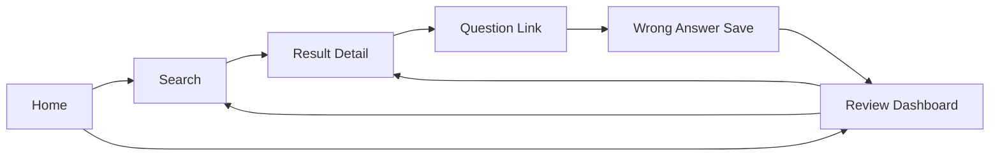
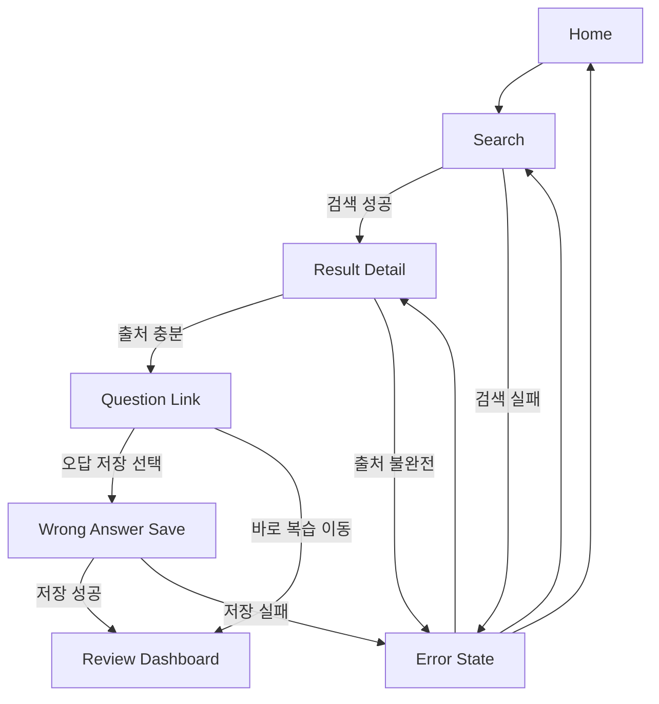

# 화면 흐름도: AI_SYS

작성일: 2026-04-02  
문서 버전: v1.0

> 안내: 본 문서는 현재 기획 및 정리 기준으로 작성되었으며, 추후 개발 과정에서 요구사항, 구현 범위, 검증 결과에 따라 내용이 변경될 수 있습니다.

## 1. 문서 목적
이 문서는 AI_SYS의 주요 화면 간 이동 구조를 정의한다.  
사용자 여정 문서가 사용자의 행동과 시스템 반응을 설명한다면, 이 문서는 실제 서비스 화면이 어떤 순서로 전환되고 어디서 분기되는지를 설계 관점에서 정리하는 데 목적이 있다.

## 2. 화면 목록
- Home (= Review Dashboard): 앱 첫 진입 화면. 오늘 복습 추천, 최근 오답 기록, 판례 검색 이동 버튼 제공
- Camera / OCR: 문제 지문 사진 촬영 및 텍스트 추출 화면
- Search: 키워드 입력, 판례 번호 입력, OCR 추출 텍스트 기반 판례 검색 및 결과 확인 화면
- Result Detail: 판례 요약, 쟁점, 결론, 출처, 유사 판례 목록 확인 화면
- Question Link: 관련 문제 풀이 화면
- Wrong Answer Save: 오답 저장 화면
- Error State: 검색 실패, 출처 불완전, 저장 실패 등 예외 안내 상태

## 3. 메인 화면 흐름

### 3.1 기본 사용자 경로
1. 사용자는 앱 실행 시 Home(복습 대시보드)에서 오늘 복습 추천과 최근 오답을 확인한다.
2. 판례 검색이 필요하면 Search로 이동하거나 Camera/OCR로 문제 지문을 촬영한다.
3. Camera/OCR에서 텍스트가 추출되면 Search 화면으로 자동 전환된다.
4. Search에서 키워드, 판례 번호, OCR 텍스트 중 하나를 기반으로 검색 결과를 확인한다.
5. Result Detail에서 판례 쟁점, 결론, 시험 포인트, 출처, 유사 판례를 확인한다.
6. Question Link에서 관련 문제를 풀며 판례 이해도를 점검한다.
7. Wrong Answer Save에서 틀린 문제나 헷갈린 쟁점을 저장한다.
8. 다음 세션 진입 시 Home(복습 대시보드)에 오답 기반 복습 추천이 갱신된다.

### 3.2 재방문 사용자 경로
1. 사용자는 앱 재실행 시 Home(복습 대시보드)에서 복습 항목을 바로 확인한다.
2. 복습 시작 버튼으로 Question Link에 직접 진입하거나, 특정 판례를 선택해 Result Detail로 이동한다.
3. 복습 중 추가 판례가 필요하면 Search 또는 Camera/OCR로 재이동한다.

## 4. 화면별 전이 규칙

### A. Home (복습 대시보드)
- 진입 조건: 앱 첫 실행 또는 재방문 시작점 (홈 화면 = 복습 대시보드)
- 이동 가능 화면:
  - Search
  - Camera / OCR
  - Result Detail (복습 목록에서 특정 판례 선택 시)
  - Question Link (복습 시작 버튼 선택 시)

### A-1. Camera / OCR
- 진입 조건: Home 또는 Search에서 사진으로 검색 선택
- 이동 가능 화면:
  - Search (OCR 텍스트 추출 완료 후 자동 전환)
  - Home (취소)

### B. Search
- 진입 조건: Home에서 판례 검색 선택 또는 Camera/OCR에서 텍스트 추출 완료
- 입력 방식: 키워드 입력 / 판례 번호 입력 / OCR 추출 텍스트 자동 입력
- 이동 가능 화면:
  - Result Detail
  - Camera / OCR
  - Error State
  - Home

### C. Result Detail
- 진입 조건: Search 결과 중 특정 판례 선택, 또는 Home 복습 목록에서 판례 선택
- 이동 가능 화면:
  - Question Link
  - Result Detail (유사 판례 선택 시)
  - Search
  - Error State

### D. Question Link
- 진입 조건: Result Detail에서 관련 문제 보기 선택, 또는 Home에서 복습 시작 선택
- 이동 가능 화면:
  - Wrong Answer Save
  - Result Detail
  - Home

### E. Wrong Answer Save
- 진입 조건: 문제 풀이 중 오답 저장 선택
- 이동 가능 화면:
  - Home (저장 완료 후)
  - Result Detail
  - Error State

### F. Error State
- 진입 조건:
  - 검색 결과 부족
  - 출처 확인 실패
  - 오답 저장 실패
- 이동 가능 화면:
  - Search로 재시도
  - Result Detail로 복귀
  - Home으로 이동

## 5. 예외 분기 흐름

### 5.1 검색 실패 분기
1. Search에서 검색 결과가 충분하지 않으면 Error State를 표시한다.
2. 시스템은 유사 키워드 또는 관련 과목 기준 재검색 옵션을 제공한다.
3. 사용자는 Search로 돌아가 검색어를 수정한다.

### 5.2 출처 불완전 분기
1. Result Detail에서 출처가 충분하지 않으면 경고 상태를 표시한다.
2. 시스템은 단정형 설명보다 관련 후보 판례를 우선 제안한다.
3. 사용자는 Search로 돌아가 다른 판례를 비교할 수 있다.

### 5.3 오답 저장 실패 분기
1. Wrong Answer Save에서 저장 실패 시 Error State를 표시한다.
2. 시스템은 임시 저장 또는 재시도 옵션을 제공한다.
3. 사용자는 저장 성공 후 Review Dashboard로 이동한다.

## 6. 발표용 설명 포인트
- Home은 시작점과 재방문 진입점을 동시에 담당한다.
- Search와 Result Detail은 가장 자주 왕복되는 핵심 학습 구간이다.
- Question Link와 Wrong Answer Save는 단순 정보 조회를 학습 행동으로 전환하는 구간이다.
- Review Dashboard는 학습 종료 화면이 아니라 다음 세션 진입을 준비하는 허브 역할을 한다.

## 7. Mermaid 화면 흐름도

### 7.1 메인 플로우



### 7.2 예외 포함 플로우



## 8. 저충실도 전환 맵

```text
[Home]
  |- 판례 검색 시작 -> [Search]
  |- 복습 바로가기 -> [Review Dashboard]

[Search]
  |- 검색 결과 선택 -> [Result Detail]
  |- 결과 없음 -> [Error State]
  |- 뒤로가기 -> [Home]

[Result Detail]
  |- 관련 문제 보기 -> [Question Link]
  |- 다른 판례 비교 -> [Search]
  |- 출처 문제 -> [Error State]

[Question Link]
  |- 오답 저장 -> [Wrong Answer Save]
  |- 상세로 복귀 -> [Result Detail]
  |- 복습 이동 -> [Review Dashboard]

[Wrong Answer Save]
  |- 저장 성공 -> [Review Dashboard]
  |- 저장 실패 -> [Error State]
  |- 취소 -> [Result Detail]

[Review Dashboard]
  |- 복습 항목 선택 -> [Result Detail]
  |- 검색으로 이동 -> [Search]
  |- 홈으로 이동 -> [Home]
```