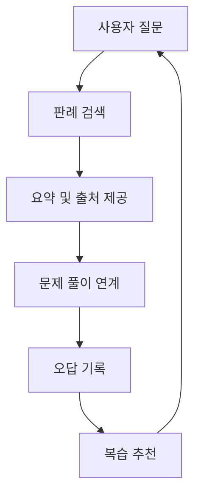

# 사용자 여정 시나리오: AI_SYS

작성일: 2026-04-02  
문서 버전: v1.0

> 안내: 본 문서는 현재 기획 및 정리 기준으로 작성되었으며, 추후 개발 과정에서 요구사항, 구현 범위, 검증 결과에 따라 내용이 변경될 수 있습니다.

## 1. 문서 목적
이 문서는 AI_SYS의 핵심 사용자인 경찰 공무원 시험 준비생이 판례를 탐색하고 이해하며 복습까지 이어가는 전체 흐름을 정의한다.  
문서 목적은 사용자 관점에서 필요한 화면과 시스템 반응을 명확히 하고, 이후 기능 구현 및 발표 시나리오의 기준을 마련하는 데 있다.

## 2. 사용자 페르소나
- 이름: 병진 (가상 사용자)
- 유형: 경찰 공무원 시험 준비생
- 목표:
  - 문제 풀이 중 필요한 판례를 빠르게 찾고 싶다.
  - 판례의 핵심 쟁점과 결론을 짧은 시간 안에 이해하고 싶다.
  - 자주 틀리는 판례와 쟁점을 반복적으로 복습하고 싶다.

주요 페인포인트
- 판례 검색을 위해 여러 사이트와 자료를 오가야 해 학습 흐름이 자주 끊긴다.
- 일반 AI 도구는 근거 없는 답변을 줄 수 있어 그대로 신뢰하기 어렵다.
- 판례를 찾은 뒤에도 시험 관점에서 어떤 부분이 중요한지 다시 정리해야 한다.
- 오답이 쌓여도 어떤 판례를 다시 봐야 하는지 체계적으로 관리하기 어렵다.

### 2.1 여정 설계 원칙
- 빠른 접근: 키워드나 사건명만으로 바로 검색이 가능해야 한다.
- 근거 중심: 답변에는 판례 출처와 요약 근거가 함께 제공되어야 한다.
- 학습 연속성: 검색, 이해, 문제 적용, 복습이 끊기지 않고 이어져야 한다.
- 개인화 복습: 사용자의 오답 이력과 취약 쟁점을 복습 흐름에 반영해야 한다.
- 다양한 진입: 키워드, 사진 촬영(OCR), 판례 번호 입력 어느 방식으로도 바로 검색이 가능해야 한다.

## 3. 핵심 사용자 여정

### 단계 1. 문제 풀이 중 막히는 지점 발생
- 사용자 행동: 경찰 공무원 시험 기출 문제를 풀다가 특정 판례나 법리를 이해하지 못한다.
- 시스템 반응: 키워드 입력, 사진 촬영, 판례 번호 입력 중 하나를 선택할 수 있는 검색 진입점을 제공한다.

### 단계 2. 판례 검색 진입
- 사용자 행동 A (사진 촬영): 앱 내 카메라를 열어 문제 지문을 촬영한다.
  - 시스템 반응: OCR로 텍스트를 추출하여 자동으로 판례 검색을 시작한다.
- 사용자 행동 B (판례 번호 입력): 해설지에 표기된 판례 번호를 직접 입력한다.
  - 시스템 반응: 내부 DB에서 사건번호 기준으로 판례를 조회하고, 관련 원문과 메타데이터를 기반으로 LLM 요약 단계로 연결한다.
- 사용자 행동 C (키워드 입력): 영장주의, 현행범 체포, 위법수집증거 등 키워드를 입력한다.
  - 시스템 반응: 관련 판례 후보와 우선순위가 높은 결과를 빠르게 제시한다.
- 기대 UX: 검색 결과에 사건명, 핵심 키워드, 관련 과목 정보가 함께 보인다.

### 단계 3. 판례 요약 확인
- 사용자 행동: 검색 결과 중 하나를 선택해 상세 내용을 확인한다.
- 시스템 반응: 판례의 쟁점, 결론, 시험 포인트, 출처를 카드 형식으로 요약한다. 유사 판례 목록도 판례 요약, 사건번호와 함께 제공한다.
- 기대 UX: 긴 판결문을 읽지 않아도 핵심 논점을 빠르게 파악하고, 유사 판례로 바로 이동할 수 있다.

### 단계 4. 문제 풀이 연계
- 사용자 행동: 해당 판례와 연결된 기출 문제나 예상 문제를 풀어본다.
- 시스템 반응: 관련 문항을 제공하고, 정답 여부에 따라 이해도를 점검한다.
- 기대 UX: 판례 이해가 바로 문제 적용으로 이어져 학습 전이가 쉬워진다.

### 단계 5. 오답 기록 및 복습 추천
- 사용자 행동: 문제를 틀리거나 헷갈린 판례를 오답으로 저장한다.
- 시스템 반응: 취약 판례와 쟁점을 누적 기록하고, 우선 복습 목록을 추천한다.
- 기대 UX: 사용자는 따로 오답노트를 정리하지 않아도 복습 루틴을 이어갈 수 있다.

### 단계 6. 재방문 학습
- 사용자 행동: 다음 학습 세션에서 앱을 열면 복습 대시보드가 홈 화면으로 바로 보인다.
- 시스템 반응: 자주 틀린 판례, 최근 오답 기록, 취약 쟁점을 요약해 보여준다.
- 기대 UX: 사용자는 어디서부터 다시 볼지 고민하지 않고 대시보드에서 바로 복습을 시작할 수 있다.

## 4. 운영 및 검증 여정

### 단계 1. 데이터 준비
- 운영자 행동: 시험 대비에 필요한 판례 데이터를 수집하고 정제한다.
- 시스템 반응: 판례 원문, 요약 정보, 메타데이터를 검색 가능한 형태로 구성한다.

### 단계 2. 검색 및 응답 품질 점검
- 운영자 행동: 대표 키워드와 쟁점 시나리오로 검색 정확도와 응답 품질을 검증한다.
- 시스템 반응: 상위 검색 결과, 요약 품질, 출처 노출 여부를 로그로 확인 가능하게 한다.

### 단계 3. 사용자 테스트
- 운영자 행동: 실제 수험생 또는 유사 사용자에게 검색-풀이-복습 흐름을 테스트한다.
- 시스템 반응: 사용 시간, 검색 성공률, 복습 재방문 지표를 수집한다.

### 단계 4. 품질 개선 반영
- 운영자 행동: 사용자 피드백과 오답 패턴을 분석해 검색 로직과 요약 프롬프트를 개선한다.
- 시스템 반응: 더 정확한 검색 우선순위와 더 간결한 시험형 요약으로 품질을 높인다.

## 5. 대표 시나리오 (Happy Path)
1. 사용자는 경찰 형법 기출 문제를 풀다가 위법수집증거 관련 판례가 기억나지 않아 앱을 열고 문제 지문을 카메라로 촬영한다.
2. OCR로 텍스트가 추출되어 자동으로 관련 판례 목록이 표시된다.
3. 사용자는 상세 요약 카드에서 쟁점, 결론, 시험 포인트를 확인하고, 유사 판례도 함께 살펴본다.
4. 이어서 연결된 기출 문제를 풀고, 틀린 경우 해당 판례를 오답 항목으로 저장한다.
5. 다음 학습 세션에서 앱을 열면 홈(복습 대시보드)에 위법수집증거 관련 판례가 복습 추천 목록으로 표시된다.

## 6. 예외 시나리오
- E1. 검색 결과 부족: 입력 키워드가 모호할 경우 유사 키워드나 관련 과목 기준 재검색을 제안한다.
- E2. 출처 확인 실패: 판례 원문 연결이 불완전하면 요약 제공 범위를 제한하고 확인 필요 상태를 표시한다.
- E3. 요약 신뢰도 저하: 검색 결과와 질문 맥락의 일치도가 낮으면 단정형 답변 대신 관련 판례 후보를 우선 노출한다.
- E4. 복습 데이터 저장 실패: 오답 저장에 실패하면 임시 보관 후 재시도하도록 안내한다.
- E5. OCR 추출 실패: 사진 품질이 낮아 텍스트 추출에 실패하면 직접 입력 또는 재촬영을 안내한다.
- E6. 사법 포털 조회 실패: 판례 번호 입력 후 외부 포털 연결에 실패하면 오류를 안내하고 키워드 검색으로 대체할 수 있도록 제안한다.

## 7. KPI 연결
- 검색 성공률: 사용자가 첫 검색 또는 재검색 내에서 원하는 판례를 찾는 비율
- 요약 활용률: 검색 후 상세 요약 화면까지 도달하는 비율
- 문제 연계 사용률: 판례 조회 후 관련 문제 풀이로 이어지는 비율
- 복습 재방문율: 오답 저장 후 다시 복습 화면에 진입하는 비율

## 8. 시각자료 (Mermaid)

### 8.1 핵심 사용자 여정

### 8.2 학습 지원 루프

