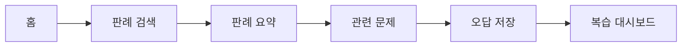
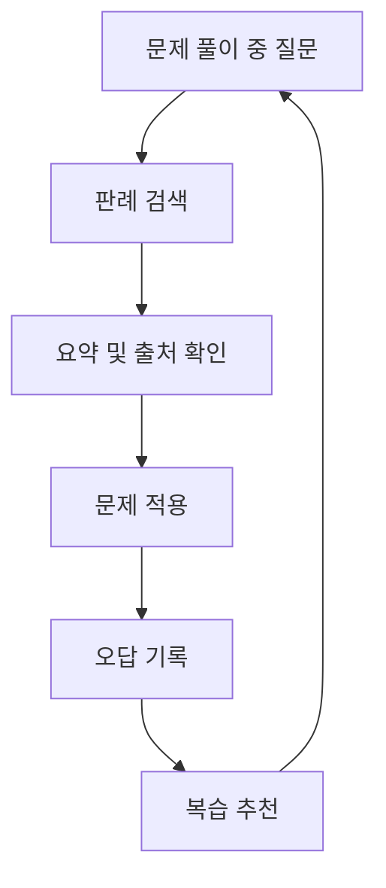

# Wireframe: AI_SYS

작성일: 2026-04-02  
문서 버전: v1.0

> 안내: 본 문서는 현재 기획 및 정리 기준으로 작성되었으며, 추후 개발 과정에서 요구사항, 구현 범위, 검증 결과에 따라 내용이 변경될 수 있습니다.

## 1. 인터랙션 구조 개요

문제 정의 정렬 메모
- 본 와이어플로우는 수험생이 문제 풀이 도중 판례를 찾기 위해 여러 도구를 오가는 부담을 줄이기 위해 검색 -> 요약 -> 문제 적용 -> 복습 흐름을 최소 단계로 구성한다.
- 결과 화면은 긴 판결문 열람보다 핵심 쟁점과 시험 포인트 파악에 집중할 수 있도록 카드 구조를 우선한다.
- 복습 화면은 단순 기록 보관이 아니라 다음 학습 세션의 시작점을 제안하는 방향으로 설계한다.

핵심 플로우
1. 홈 (복습 대시보드) 진입
2. 판례 검색 또는 사진 촬영 진입
3. 판례 요약 확인 (유사 판례 포함)
4. 관련 문제 풀이
5. 오답 저장
6. 복습 대시보드 복귀

보조 플로우
1. 검색 실패 시 유사 키워드 제안
2. 출처 부족 시 후보 판례 우선 노출
3. 오답 저장 실패 시 임시 저장 안내

---

## 2. 앱 와이어플로우 (Low-Fidelity)

### Screen A. 홈 (복습 대시보드 · 검색한 판례·유사 판례 모아보기 + 오늘 복습 추천)

```text
+------------------------------------------------+
| 복습 대시보드                                  |
| 오늘 복습 추천                                  |
| 1. 위법수집증거 판례                           |
| 2. 현행범 체포 요건                             |
| 3. 영장주의 예외                                |
|                                                |
| 최근 오답                                      |
| - 판례 A / 증거능력                             |
| - 판례 D / 체포 적법성                          |
|                                                |
| [복습 시작] [판례 검색으로 이동]                    |
+------------------------------------------------+
```

### Screen A-1. 카메라 / OCR 촬영

```text
+------------------------------------------------+
| 문제 지문 촬영                                  |
| +------------------------------------------+  |
| |                                          |  |
| |         [ 카메라 런스 화면 ]              |  |
| |                                          |  |
| +------------------------------------------+  |
|                                                |
| 촬영 영역을 문제 지문에 맞춰주세요            |
|                                                |
| [콘텐츠 촬영] [취소]                            |
+------------------------------------------------+

[OCR 처리 중]
+------------------------------------------------+
| 텍스트 추출 중...                                |
| 추출된 텍스트: "위법수집증거..."              |
|                                                |
| [판례 검색으로 이동] [직접 수정]                   |
+------------------------------------------------+
```

### Screen B. 판례 검색

```text
+------------------------------------------------+
| 판례 검색                                      |
| 키워드: [위법수집증거____________________]     |
| 판례 번호: [2019도123456__________________]    |
|                                                |
| [사진으로 검색 (카메라)]                        |
|                                                |
| 추천 키워드: [영장주의] [자백배제법칙]         |
|                                                |
| 검색 결과                                      |
| 1. 판례 A - 위법수집증거 예외 요건             |
| 2. 판례 B - 영장 없는 압수수색                 |
| 3. 판례 C - 증거능력 판단 기준                 |
|                                                |
| [상세 보기]                                    |
+------------------------------------------------+
```

### Screen C. 판례 요약

```text
+------------------------------------------------+
| 판례 요약                                      |
| 판례명: 판례 A                                 |
| 사건번호: 대판연 2019도123456                   |
| 쟁점: 위법수집증거의 증거능력 인정 범위         |
| 결론: 예외적 인정 여부는 엄격하게 판단         |
| 시험 포인트: 영장주의와의 연결                  |
| 출처: 대법원 판례 / 사건번호                    |
|                                                |
| 유사 판례                                     |
| - 판례 E: 영장주의 예외 (대판연 2017도98765)    |
|   [요약 보기] [판례로 이동]                     |
| - 판례 F: 증거능력 판단 기준 (대판연 2018도54321) |
|   [요약 보기] [판례로 이동]                     |
|                                                |
| [관련 문제 보기] [다른 판례 비교]              |
+------------------------------------------------+
```

### Screen D. 관련 문제 풀이

```text
+------------------------------------------------+
| 관련 문제                                      |
| Q. 위법수집증거에 관한 설명으로 옳은 것은?      |
|                                                |
| (1) ...                                        |
| (2) ...                                        |
| (3) ...                                        |
| (4) ...                                        |
|                                                |
| [정답 확인] [오답 저장]                        |
+------------------------------------------------+
```

### Screen E. 오답 저장

```text
+------------------------------------------------+
| 오답 저장                                      |
| 문제: 위법수집증거 관련 문항                   |
| 연결 판례: 판례 A                              |
| 헷갈린 쟁점: [__________________________]      |
| 메모: [_______________________________]        |
|                                                |
| [저장] [취소]                                  |
+------------------------------------------------+
```

### Screen F. 복습 대시보드 (홈 화면 = 검색한 판례·유사 판례 모아보기 + 오늘 복습 추천)

```text
+------------------------------------------------+
| 복습 대시보드                                  |
| 오늘 복습 추천                                  |
| 1. 위법수집증거 판례                           |
| 2. 현행범 체포 요건                             |
| 3. 영장주의 예외                                |
|                                                |
| 최근 오답                                      |
| - 판례 A / 증거능력                             |
| - 판례 D / 체포 적법성                          |
|                                                |
| [복습 시작] [판례 검색으로 이동]                    |
+------------------------------------------------+

→ Screen A (홈)와 동일한 복습 대시보드.
  앱 실행 시 판례 검색이 아닌 복습 대시보드가 첫 화면으로 보인다.
```

---

## 3. 상태 및 예외 메시지

- E1. 검색 결과 부족: 원하는 판례를 찾지 못했습니다. 유사 키워드로 다시 검색해보세요.
- E2. 출처 불완전: 현재 요약은 참고용입니다. 원문 출처 확인이 필요합니다.
- E3. 응답 신뢰도 낮음: 질문과 일치하는 판례가 불충분하여 관련 후보를 먼저 보여드립니다.
- E4. 오답 저장 실패: 저장 중 오류가 발생했습니다. 잠시 후 다시 시도해주세요.

---

## 4. 운영자 검증 플로우

### Step A. 데이터 점검

```text
판례 데이터 수집 상태 확인
- 과목별 판례 수
- 출처 링크 유무
- 키워드 매핑 상태
```

### Step B. 검색 품질 확인

```text
검색어 입력: 위법수집증거
상위 결과 확인
- 판례 관련성
- 쟁점 요약 정확성
- 출처 표시 여부
```

### Step C. 사용자 흐름 검증

```text
문제 풀이 -> 판례 검색 -> 요약 확인 -> 문제 적용 -> 오답 저장
각 단계에서 이탈 여부 및 사용 시간 확인
```

---

## 5. 시각자료 (Mermaid)

### 5.1 화면 흐름



### 5.2 학습 루프


